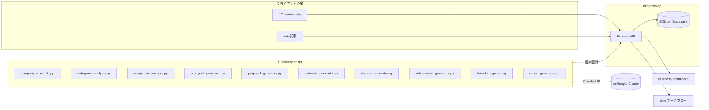
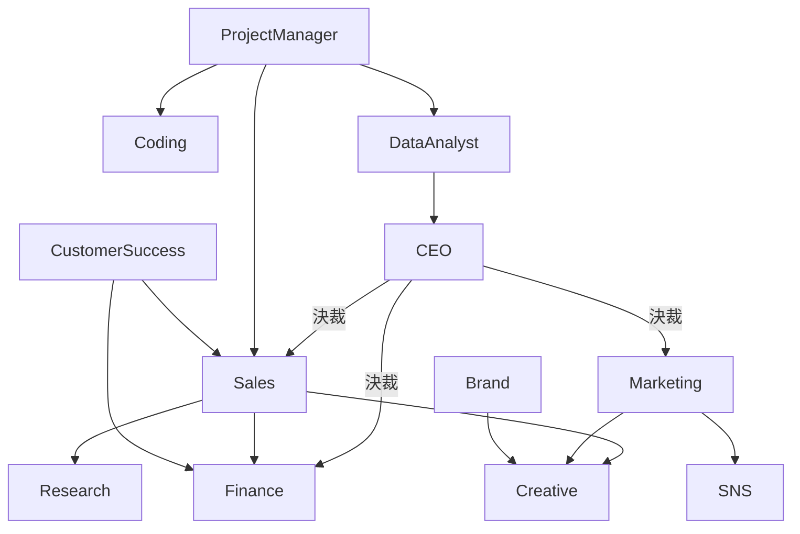

# 構成図

## ディレクトリ構成
```
business/
├── docs/            戦略ドキュメント（分析/採点/ロードマップ/TODO/KPI等）
├── agents/          12 AIエージェントの役割定義（人間可読）
├── prompts/         各エージェントのシステムプロンプト本文（実行時に読み込む単一ソース）
├── services/        TOP5サービスの商品設計
├── scripts/         自動化スクリプト（Python、Claude API利用）
├── api/             CRM/営業自動化API（Node.js + TypeScript + SQLite）
├── crm/             CRMのDBスキーマ正本（Supabase/Postgres移行用）
├── dashboard/        KPIダッシュボード（静的HTML、api/を参照）
├── sales/           営業プレイブック・営業メールテンプレート
├── proposal/        提案書テンプレート
├── estimate/        見積テンプレート・料金表
├── contracts/       契約書・NDAテンプレート
├── branding/        ブランド診断・ロゴ提案テンプレート
├── research/        企業分析テンプレート
├── instagram/       Instagram診断チェックリスト・投稿カレンダーテンプレート
├── note/            note記事ドラフト
├── lp/              ランディングページ（自己完結HTML）
├── templates/        議事録・KPIレポート等の汎用テンプレート
├── automation/       全体ワークフロー定義・n8nワークフロー雛形
├── config/           料金・エージェント設定（単一ソース）
├── assets/           ブランド素材置き場
├── create/           生成物の出力先（gitignore対象）
├── github/           GitHub運用ドキュメント（実行系は /.github/workflows）
└── tests/            自動化スクリプトのテスト
```

## システム構成図


## エージェント連携図

